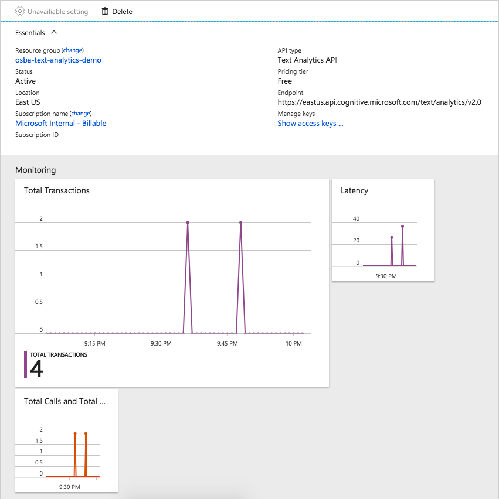

# Open Service Broker for Azure Text Analytics

Simple demo using Open Service Broker for Azure to provision and use an Azure text analytics API. When running this sample, the following takes place:

- Azure resource group and text analytics API are created.
- A Kubernetes secret is automatically created with the address and credentials for the text analytics API.
- A pod is started that consumes the secrets, runs the [osba-text-analytics-demo.py](https://github.com/neilpeterson/open-service-broker-azure-samples/blob/master/osba-text-analytics/osba-text-analytics-demo.py), which submits a text analytics request to the API.

# Run the sample

First you need a Kubernetes cluster with the Open Service Broker for Azure installed and configured. See this [documentation](https://docs.microsoft.com/en-us/azure/aks/integrate-azure) for steps on configuring OSBA in an Azure Container Service (AKS) cluster.

NOTE: Azure text analytics is not currently included in the Open Service Broker for Azure. I have created a fork with this functionality. Use the following command to run the OSBA fork.

```
helm install azure/open-service-broker-azure --name osba --namespace osba \
  --set azure.subscriptionId=$AZURE_SUBSCRIPTION_ID \
  --set azure.tenantId=$AZURE_TENANT_ID \
  --set azure.clientId=$AZURE_CLIENT_ID \
  --set azure.clientSecret=$AZURE_CLIENT_SECRET \
  --set modules.minStability=experimental \
  --set image.repository=neilpeterson/open-service-broker-azure_broker \
  --set image.tag=text-analytics
```

Once OSBA is configured, the sample can be deployed with the manifest found in this repo or with a Helm chart (detailed here).

Add the azure-samples chart repository:

```
helm repo add azure-samples https://azure-samples.github.io/helm-charts/
```

Run the chart:

```
helm install azure-samples/osba-text-analytics-demo
```

## Artifacts

**Analytics API and sentiment results**:

If you open the Azure portal and browse to the named resource group, you should see that a text analytics API has been created.



Get the name of the running pod.

```
$ kubectl get pods

NAME                                        READY     STATUS        RESTARTS   AGE
osba-text-analytics-demo-58c9c6d54f-p5bkn   1/1       Running       0          5s
```

And pull logs from the pod. You will see that the application running in the pod sent a pre-baked request to the text analytics API which returned sentiment results.

```
$ kubectl logs osba-text-analytics-demo-58c9c6d54f-p5bkn
==============================
Provided text: This is a positive statement.
Positive sentiment:0.9400990605354309
==============================
That was cool, please shut me down now.
```
